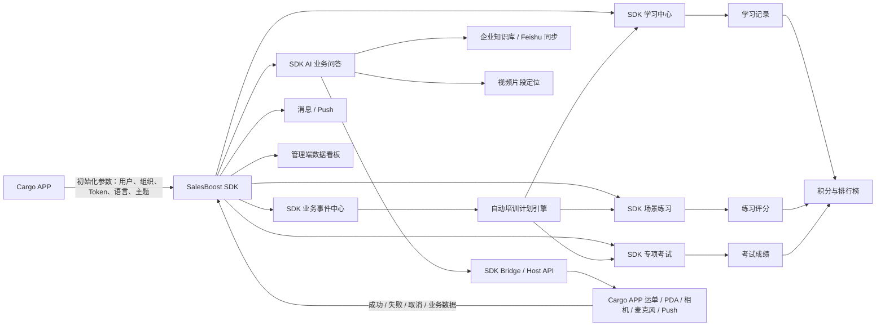

# Cargo APP × SalesBoost SDK 快递员智慧业务助手解决方案

> SalesBoost SDK 快递行业完整解决方案（基于 BeautyAI 版本改造）  
> 版本：SalesBoost SDK v1.0 · 2026-08-03

参考母版： [美妆行业 AI 辅助培训解决方案——智能化 BA 赋能体系（飞书文档）](https://jcnrjfkoqxl7.feishu.cn/wiki/X2jzw5cFCi0358klMqXc8RSxnIb)

## 一、方案概述

快递员的一线工作同时包含“业务操作”和“规则学习”两类任务：扫描、派送、签收、退件、异常件登记等动作需要严格遵循 SOP；一旦发生错扫、签收失败或违规退件，现场人员又需要快速查找有效规范、完成纠正并接受后续培训。传统模式存在四个突出问题：

1. 异常发现、业务处置和培训之间相互割裂，问题处理完成后无法形成持续改进。
2. 一线人员在 PDA 操作现场很难快速定位到正确的制度版本、页码和视频片段。
3. 不同网点、区域和人员对同一业务场景的处理方式不一致，容易形成错误轨迹或合规风险。
4. 培训、练习和考试结果缺少统一记录，管理者无法判断“是否学会、是否会做、是否真正完成闭环”。

本方案面向 Cargo APP 内的快递员用户，以 **SalesBoost SDK** 的形式植入 Cargo APP。Cargo APP 负责账号登录、员工身份、主导航、运单与 PDA 业务、相机/麦克风权限、Push 和业务安全；SalesBoost SDK 在 Cargo APP 提供的用户与业务上下文中，承载 AI 助手、知识学习、场景练习、专项考试、自动培训计划和结果回传能力。

SalesBoost SDK 构建覆盖“识别、诊断、执行、教、练、考、管、激励、回传”的一体化闭环。系统以企业知识库和 Cargo APP 传入的业务事件为核心输入，以 SOP 引用、Cargo APP 业务动作调用、自动培训计划、AI 场景模拟、专项考试和积分排名为主要输出，帮助一线人员在最短时间内完成正确处置，并把一次业务异常转化为可追踪的能力提升过程。

### 核心价值主张

| 维度 | 快递业务传统痛点 | SalesBoost 方案 |
| --- | --- | --- |
| 现场效率 | 出现错扫、签收失败时，需要在多个系统和群聊中查找规则 | 业务助手支持文字、语音、图片提问，直接返回处置步骤、 SOP 和定位页码 |
| 业务标准化 | 不同网点对撤销、重扫、留痕、退件的处理口径不一致 | 以企业知识库为唯一依据，统一引用版本、有效期、权限和操作节点 |
| 业务闭环 | AI 建议与实际 PDA 操作脱节，处理结果无法回传 | SalesBoost SDK 通过 Cargo APP Bridge 调用运单/PDA 业务动作，并接收成功、失败和取消回调 |
| 培训触达 | 异常发生后通常只做口头提醒，缺少针对性培训 | 业务事件自动生成智能培训计划，按“课程 → 场景模拟 → 测试”推进 |
| 能力验证 | 只看是否完成培训，无法判断是否会在真实场景中正确操作 | 物流场景对练、逐节点复盘和 12 类题型考试，覆盖知识、判断、话术与材料留存 |
| 激励与追踪 | 学习、练习、考试记录分散，缺少持续激励 | 积分流水、部门/区域/全国排行榜、月度冻结快照和消息中心统一呈现 |

## 二、系统架构总览



### 架构分层

| 层级 | 主要职责 | 对应实现 |
| --- | --- | --- |
| Cargo APP 层 | 提供登录态、员工/组织身份、主导航、运单/PDA 业务、设备权限、Push 和安全策略 | 由 Cargo APP 统一负责，SalesBoost SDK 不重复建设 |
| SalesBoost SDK 层 | 在 Cargo APP 容器中承载助手、学习、练习、考试、计划、消息和结果展示 | 支持 WebView SDK、Hybrid SDK 或原生组件包等集成形态 |
| Bridge 协议层 | 规范 Cargo APP 与 SalesBoost SDK 的双向调用、事件和错误码 | Cargo APP 向 SDK 注入用户/业务上下文；SDK 调用扫描、运单、相机、麦克风等能力并接收结果回调 |
| AI 能力层 | 问答、知识检索、图片理解、语音识别、场景评分 | 接入 LLM、RAG、OCR/视觉、ASR/TTS 和评分服务 |
| 内容与知识层 | SOP、制度、操作手册、视频、FAQ、案例、公告 |支持版本、溯源、有效期、权限和定位信息 |
| 训练运营层 | 计划编排、课程、场景、考试、补训、积分和榜单 | 训练状态由服务端统一管理，并与 Cargo APP 用户 ID 关联 |
| 管理与分析层 | 查看异常、完成率、成绩、练习表现和排名 | 对接管理端看板与数据仓库 |

### SalesBoost SDK 与 Cargo APP 的职责边界

| 能力 | Cargo APP 负责 | SalesBoost SDK 负责 |
| --- | --- | --- |
| 身份与权限 | 登录、Token 刷新、员工/组织/区域权限 | 消费 Cargo APP 传入的身份上下文，不提供第二套登录体系 |
| 导航与页面容器 | 决定 SDK 入口、返回行为、主导航和页面栈 | 提供可嵌入页面/组件及 SDK 内部子路由 |
| 业务操作 | 运单查询、扫描、撤销、异常件登记、业务审核 | 根据 AI 结果发起 Host API 调用，展示执行前说明和执行后反馈 |
| 设备能力 | 相机、相册、麦克风、文件选择、网络与通知权限 | 通过 Bridge 请求设备能力，并处理授权结果和业务文件 |
| AI 与培训 | 提供必要业务上下文和事件 | 问答、知识引用、计划、课程、练习、考试、积分和结果回传 |
| 数据安全 | Cargo APP 安全容器、设备策略、Token 管理 | 最小化采集、敏感字段脱敏、接口签名校验和 SDK 侧日志规范 |

## 三、模块详细说明

### 模块一：业务助手与异常诊断

**核心定位：让快递员在业务现场“问得到、看得懂、做得对”。**

#### 快递员端功能

| 功能 | 说明 |
| --- | --- |
| 文字问答 | 输入业务问题，返回标准处理建议 |
| 语音提问 | 点击麦克风进行语音识别，快速输入现场业务问题 |
| 图片补充 | 上传现场 PDA 截图或异常件照片，通过 OCR/视觉理解补充问题上下文 |
| 处置步骤卡 | 将回答拆成“停止操作 → 核对信息 → 撤销错扫 → 重新扫描”等可勾选步骤 |
| SOP 引用 | 展示文档名称、版本、更新时间和页码，进入知识详情查看有效内容 |
| 视频定位 | 将问题定位到视频 01:35“进入扫描记录撤销错误节点”的片段 |
| 反馈闭环 | 对回答进行有帮助/无帮助反馈，为后续知识质量分析提供入口 |

#### 典型使用场景举例：PDA 错扫

1. 系统识别运单 `JT3049827156` 的 `E-SCAN-102` 异常。
2. 快递员进入异常详情，看到异常类型、错误节点、应选节点和影响判断。
3. AI 给出三步处置建议，并引用《PDA 扫描异常处理 SOP》第 12 页。
4. 快递员可进入视频定位；需要执行操作时，SalesBoost SDK 通过 Bridge 唤起 Cargo APP 的扫描记录或重新扫描页面。

### 模块二：企业知识中心与学习中心

**核心定位：把分散在制度、手册、视频和案例中的业务知识，变成可搜索、可定位、可验证的统一内容入口。**

#### 内容分类

| 分类 | 内容示例 |
| --- | --- |
| AI 课堂 | PDA 错扫纠正专项课、签收失败四步处理法、违规退件风险速查 |
| 制度规范 | 收派业务合规管理制度、违规退件判定与申诉规则 |
| 操作手册 | PDA 扫描设备操作手册、签收失败标准处理流程 |
| 视频教程 | PDA 异常件登记、破损件现场拍照 |
| FAQ | PDA 常见错误码、派件常见问题在线答疑 |
| 历史案例 | E-SCAN-102 错扫事件复盘、违规退件申诉成功案例 |
| 公告通知 | 扫描规范更新、新版 PDA 功能上线 |

#### 学习中心能力

- 支持搜索标题和摘要，按 AI 课堂、制度、手册、视频、FAQ、案例、公告筛选。
- 资料卡展示格式、版本、更新时间、来源和预计阅读时长。
- 支持 Word、PDF、PPT、Excel、网页、视频六种应用内预览。
- PDF 支持翻页；PPT 支持前后页切换；Excel 展示错误码表格；视频支持播放、暂停、进度和片段定位。
- 知识详情展示有效期、权限范围、来源和 AI 引用定位，避免引用失效或无权限内容。

### 模块三：事件驱动的自动培训计划

**核心定位：让业务异常自动转化为一条有截止时间、可逐步完成的个人提升计划。**


| 节点 | 内容 | 推送规则 |
| --- | --- | --- |
| 事件识别 | 客户系统识别多次派件错扫异常 | - |
| 专项课程 | 《PDA 错扫纠正专项课》 | 客户业务系统推送事件后 |
| 场景模拟 | PDA 错扫处理场景模拟，覆盖 3 个 SOP 节点 | 完成课程后推送 |
| 专项考试 | 80 分通过，未通过自动追加补训 | 完成场景模拟后推送 |
|  |
| 计划完成 | 学习结果回传，增加 120 积分 | 考试通过后完成 |

计划详情页以时间线和状态标签展示“已完成、进行中、未解锁、未通过”，并显示截止时间、通过线、考试次数和最近得分。

### 模块四：AI 业务场景陪练

**核心定位：把“知道 SOP”变成“能在真实业务分支中说清楚、做完整”。**

#### 场景资产

| 场景 | 练习重点 | 节点示例 |
| --- | --- | --- |
| PDA 错扫处理 | 核对、撤销、重扫、轨迹确认 | 停止操作 → 核对运单/实物/轨迹 → 撤销并重扫 |
| 签收失败处理 | 联系留痕、地址核验、预约复派 | 联系留痕 → 核验地址 → 预约复派 |
| 客户拒收处理 | 原因核实、证据留存、退件审批 | 核实原因 → 上传照片/沟通记录 → 提交异常处理 |

#### 交互与评估

- 先展示场景背景、SOP 节点和当前练习目标，再进入对话。
- 支持文字回复和语音回复；AI 场景助手按节点返回引导和教练反馈。
- 可展开“查看提示”，提示内容直接对应当前 SOP。
- 完成后展示综合评分、SOP 完成度等复盘和改进建议。
- 结果页推荐对应课程，支持返回计划或再次模拟。

### 模块五：智能考试系统

**核心定位：验证快递员是否真正掌握业务知识、现场判断、操作顺序和材料留存要求。**

专项考试可支持以下题型：

| 类型 | 适合内容 |
| --- | --- |
| 单选、多选、判断 | 基础规则与红线判断 |
| 简答、填空 | 能否用业务语言说明动作 |
| 下拉、排序、矩阵 | 操作原因、标准顺序和分支处置 |
|  |
| 图片题（需业务培训方准备图片） | 从操作现场识别需要先核对的对象 |
| 视频题（需业务培训方准备视频） | 根据视频定位判断下一步操作 |
| 


### 模块六：Cargo APP 业务调用与结果回传


SalesBoost SDK 通过标准协议对接 Cargo APP，获得业务事件和相关业务上下文：

1. Cargo APP 初始化 SalesBoost SDK 时传入员工、组织、区域、Token、语言等上下文。
2. SDK 校验运单号、异常码和 AI 诊断上下文
3. Cargo APP 完成真实操作后，向 SDK 返回成功、失败、取消、错误码和最新业务轨迹。
4. SDK 根据回调更新异常状态、培训计划和页面提示，并将学习结果继续回传服务端。

Cargo APP 负责用户身份、运单、业务权限、设备能力和业务页面；SalesBoost SDK 负责 Bridge 协议、上下文校验、回调处理、训练状态联动和用户反馈。双方共同保证接口、超时、重试、错误码、签名和审计日志。


### 管理端：消息、积分与排行榜

#### 消息中心

- 承载业务异常、培训计划、考试提醒和积分奖励。
- 未读消息使用红色标记，点击后写入已读状态并跳转对应页面。
- 支持事件、课程、考试、补训和 Push 五类通知策略；消息中心与 Cargo APP Push 能力共享同一消息状态。

#### 积分流水

- 展示本月可用积分、获得积分、业务扣分、逐笔来源和月度冻结快照。
- 计划完成后新增“PDA 错扫专项提升计划 · 培训闭环完成”+120 分。
- 已提供连续学习、课程完成、考试通过和业务扣分等基础流水样例。

#### 排行榜

- 部门、区域、全国三种范围切换。
- 展示当前排名、与第一名的差距、人员/网点、积分和“我”标记。
- 支持月榜冻结、历史结算榜单查询和管理端归档。

## 四、系统使用全流程

以下为 SalesBoost SDK 在 Cargo APP 中的一次完整培训周期：

```text
SDK 初始化阶段
  └─ Cargo APP 初始化 SalesBoost SDK → 注入员工、网点、区域、Token 和业务权限

Day 1  业务异常发生
  ├─ 系统识别错扫事件
  ├─ 消息中心推送异常通知
  └─ 自动创建“PDA 错扫专项提升计划”

现场处置
  ├─ 打开异常详情，查看错误操作、应选操作
  ├─ 在 AI 助手 查看 SOP 步骤、操作指南等
  ├─ SalesBoost SDK 通过 Bridge 唤起 Cargo APP 的 PDA 业务页面
  └─ 撤销错误节点 → 重新扫描 → Cargo APP 将业务结果回调 SDK

Day 1-2  学习阶段
  ├─ 完成《PDA 错扫纠正专项课》
  ├─ 课程完成后解锁场景模拟
  └─ 查看知识详情和应用内资料预览

Day 2  练习阶段
  ├─ 完成 PDA 错扫场景模拟
  ├─ 文字或语音回复
  └─ 获得评分、步骤复盘和改进建议

Day 2  考试阶段
  ├─ 完成 12 类题型专项考试
  ├─ 第一次考试：68 分，通知培训师重点关注
  ├─ 培训师安排补考计划
  └─ 第二次考试：92 分，通过并完成计划

完成回传
  ├─ 学习结果回传状态变为完成
  ├─ 增加 120 积分
  ├─ 更新部门/区域/全国排行榜
  └─ 管理端可追踪异常、培训、练习和考试结果
```

## 五、方案优势总结

### 对 J&T 品牌方、运营中心和管理层

1. **异常到培训自动闭环**：业务事件不再停留在提醒层，而是自动生成个人提升计划。
2. **统一有效知识口径**：回答携带有效期、来源、权限和定位，减少引用过期的风险。
3. **业务结果可验证**：通过 SDK Bridge、运单上下文和 Cargo APP 回调状态，把“建议正确”推进到“业务轨迹正确”。
4. **培训效果可量化**：课程完成、场景评分、考试记录、补训和积分统一留痕。
5. **适合全国复制**：计划、课程、场景、考试和榜单可以按网点、区域、全国范围扩展。

### 对培训师、运营和知识管理员

1. 以业务事件和 SOP 为入口，减少人工逐人通知和重复讲解。
2. 同一份知识内容可以被 AI 问答、学习资料、练习提示和考试解析复用。
3. 可按错误码、业务类型和薄弱节点设计专项课程与题库。
4. 通过版本、有效期和权限字段管理知识生命周期，便于审计与更新。

### 对快递员和一线操作员

1. SalesBoost 能力嵌入 Cargo APP，无需安装独立应用或切换到多个培训系统。
2. 支持文字、语音、图片、文档、视频和场景练习等多种学习方式。
3. 训练过程不会影响真实客户关系，可反复练习直到掌握。
4. 首次考试未通过时，系统明确指出补训路径，而不是直接结束任务。
5. 积分和排行榜提供即时反馈，帮助形成持续学习习惯。

## 六、实施建议与验收口径

### 完整交付工作包

以下工作包均属于正式上线范围，不构成先后取舍关系。各工作包由对应团队并行推进，在统一接口契约下持续联调，最终共同进入端到端验收。

| 工作包 | 必须交付的范围 |
| --- | --- |
| SalesBoost SDK 集成 | SDK 交付形态、初始化与销毁、Cargo APP 与 SDK 生命周期、内部路由、主题与语言、版本兼容和异常恢复 |
| Cargo APP 业务接入 | 员工与组织上下文、Token 更新、运单/PDA Bridge API、相机/麦克风/文件能力、Push 和业务结果回调 |
| 企业知识与 AI 问答 | 企业知识库接入、RAG 检索、版本与有效期、区域权限、引用定位、回答反馈和知识更新机制 |
| 自动培训闭环 | 业务事件规则、自动培训计划、课程、场景练习、题库、考试、补训、重考、完成回传和状态一致性 |
| 多模态智能能力 | 文字问答、图片理解、OCR、ASR、TTS、视频定位、场景对话评分、个性化推荐和薄弱点分析 |
| 运营与激励体系 | 消息中心、Push 策略、积分流水、积分结算、部门/区域/全国榜单和历史榜单归档 |
| 管理与数据分析 | 员工、网点、区域数据权限，异常处理、学习完成、练习评分、考试成绩、薄弱点和排名看板 |
| 安全与质量保障 | 接口签名、数据脱敏、权限校验、幂等、超时重试、审计日志、监控告警、埋点和多端一致性 |

### 整体验收标准

- Cargo APP 可完成 SalesBoost SDK 的初始化、销毁、Token 更新、路由打开和异常恢复；SDK 不要求用户重复登录。
- SalesBoost SDK 能正确消费 Cargo APP 传入的员工、组织、语言、主题和运单上下文。
- 业务异常可带出运单号、错误码、事件时间，并能自动生成培训计划和消息通知。
- 文字、语音、图片问答可返回具有版本、有效期、权限和位置引用的企业知识答案。
- SalesBoost SDK 可通过 Bridge 调用 Cargo APP 的运单、PDA、相机、麦克风、文件和视频能力，并正确处理成功、失败、取消和超时结果。
- 课程、场景、考试、补训、重考、计划完成和积分流水状态一致。
- 至少支持 PDA 错扫、签收失败、客户拒收三类场景，并可按区域/网点配置。
- Push、消息已读状态、积分结算、部门/区域/全国榜单和历史归档数据一致。
- 管理端可按员工、网点、区域查看异常处理、学习完成、考试成绩、练习评分和积分排名。
- 身份权限、知识权限、接口签名、数据脱敏、审计日志、监控告警和错误恢复满足上线要求。
